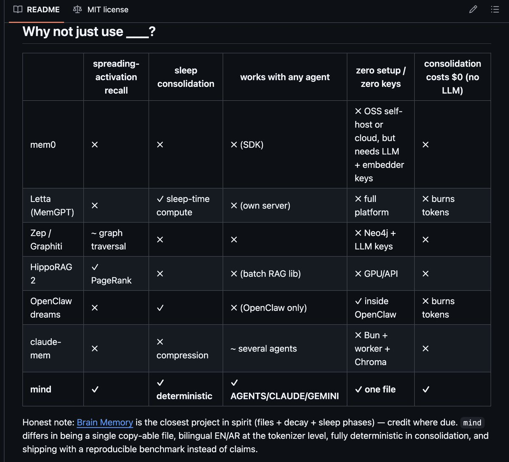

# mind — brain-like memory for any coding agent

[](https://github.com/Da7-Tech/mind/actions/workflows/ci.yml)
[](https://github.com/Da7-Tech/mind/blob/main/.github/workflows/ci.yml)
[](https://github.com/Da7-Tech/mind/blob/main/mind.py)
[](https://github.com/Da7-Tech/mind/blob/main/bench/bench.py)
[](LICENSE)
[](README.md)
[](README.ar.md)

**One Python file. Zero dependencies. Zero API keys. Fully offline. Multilingual — engineered for EN + AR, measured on 10 languages.**

Your coding agent forgets everything between sessions. `mind` gives it a memory
that works the way yours does: a weighted concept graph that recalls by
**spreading activation** (not flat search), forgets by the **Ebbinghaus curve**
(unused memories fade, reinforced ones harden), and reorganizes itself while
you sleep through a **deterministic dream cycle** — no LLM calls, no token
bill, every decision explained in a journal you can read.

It plugs into **every agent at once**: one memory, exported to `AGENTS.md`
(Kimi Code, Codex, Cursor, Zed, ...), `CLAUDE.md` (Claude Code) and `GEMINI.md` — and
adopted automatically by `.cursorrules`, `.windsurfrules`, `.clinerules`
and `.roo/rules/mind.md` in projects that already use those tools.

```bash
curl -fsSLO https://raw.githubusercontent.com/Da7-Tech/mind/v6.2.1/mind.py
python3 -c "import hashlib;h=hashlib.sha256(open('mind.py','rb').read()).hexdigest();assert h=='faccb80fdb926e3486151fb312b8cccffaf503d48790c1876dd6cd74b55a5c6c',h;print('mind.py: OK')"
python3 mind.py init
python3 mind.py remember "the project database is postgres 16"
python3 mind.py recall "which database do we use"
# recall for "which database do we use" — 1 results [0.20 ms]
#   1. [0.033] (direct) the project database is postgres 16
python3 mind.py dream        # between sessions: forget, consolidate, promote
```

That's the whole install — pinned to a release tag and
integrity-checked with nothing but `python3` (works on Windows too).
No server, no vector store, no embedding model, no configuration file.

## Measured, not vibes

Every number below comes from `python3 bench/bench.py` — rerun it yourself
(Python 3.14 on Apple M-series — latencies are environment-dependent, rerun
for your hardware; 20 bilingual queries with known answers against
distractor-filled graphs):

| graph size | recall@1 | recall@5 | median latency | p95 |
|---|---|---|---|---|
| 100 nodes | **1.00** | 1.00 | **~0.5–0.7 ms** | ~2–4 ms |
| 1,000 nodes | **1.00** | 1.00 | ~2–3 ms | ~11–16 ms |

(The long-standing 0.95 miss — a category question, "what css framework",
against a memory that only said "tailwind" — is closed by the curated
concept seed in 5.5.0. Synonymy *outside* the seed and the corpus still
misses; see limitations.)

Dream determinism: **PASS** — identical memory state always produces the
identical consolidation plan.

**180-day soak** (`bench/soak.py` — the real code driven through an injected
clock with a realistic workload: daily/weekly/monthly facts + 357 junk notes
+ a dream every night): core-fact survival **15/15** across all cadence
tiers, junk older than the grace window surviving: **0/256**, working
memory **8/8** hot slots held by core facts, graph size bounded
(~106 nodes), recall on the aged graph ~0.4 ms. The soak caught two
real calibration bugs before release (facts pruned one day before their
first monthly recall; decayed weight vetoing exact matches) — both fixed
with regression tests.

**Multilingual, measured** (`bench/multilang.py`, runs in CI): the tool is
*engineered* for English + Arabic, but the core (Unicode tokenizer, IDF,
char-n-gram fallback) is language-neutral, and 5.6.0 adds character-bigram
indexing for scripts written without spaces. Recall@1 on 8 languages it
was never tuned for, each against distractor noise:

| French | German | Spanish | Russian | Turkish | Chinese | Japanese | Korean |
|---|---|---|---|---|---|---|---|
| 3/3 | 3/3 | 3/3 | 3/3 | 3/3 | 3/3 | 3/3 | 3/3 |

(Chinese/Japanese were 3/6 before the bigram tokenizer. 3 queries per
language is a smoke benchmark, not the 20-query EN/AR suite; heavy
inflection without stemming will cost precision in cases it doesn't
cover. Thai is tokenized the same way but not yet benchmarked.)

**Discrimination, measured** (`bench/discrim.py`, runs in CI): two
independent audits correctly pointed out that needle-in-clean-noise
recall says nothing about telling apart facts that SHARE vocabulary —
so this benchmark uses only lexically competing distractors, including
the audits' exact failure cases ("what is my name" vs "file name must
match the class name", in both English and Arabic). Current score:
**12/12**, gated at ≥ 0.85 in CI so discrimination can never silently
regress again.

**Fuzzed** (`bench/fuzz.py`, seeded + deterministic): 420 adversarial
cases in the full run (CI runs the 160-case quick set on every push) — hostile graph files (NaN/Infinity, wrong-typed fields,
control characters, truncated JSON, dangling edges) and hostile CLI input.
Contract: never a traceback, never data loss, the graph always loads clean
afterwards. Its first run caught a real defect that six earlier audit
rounds had missed (see CHANGELOG 5.5.0).

**Mutation-tested** (`bench/mutate.py`): first-order defects are injected
(flipped comparisons, broken arithmetic, nudged constants) and the suite
must catch them. Its first run exposed 17 behaviors the tests didn't
actually pin down — each is now locked by a dedicated regression test
(raw kill rate on the seeded 120-mutant sample: 33% at first run, 44% today — remeasured every release; the raw number is
published because hiding it would be the exact sin this tool exists to
catch).
Surviving mutants are triaged in the tool's output: unreachable `get()`
defaults, display-only constants, and ranking-calibration values guarded
by the CI benchmark gate (recall@1 ≥ 0.9) rather than unit assertions.

Test suite: **180 tests**, stdlib `unittest`, `python3 -m unittest discover -s tests` —
including regression tests for concurrency (parallel writers must not lose
each other's memories), destructive-op gating, corrupt-graph recovery, and
a mutation-kill class where every test pins a behavior the suite
previously didn't bite on.

## How it works — three layers, like a brain

```
Layer 1  WORKING MEMORY   .mind/ACTIVE.md  → injected into agent rule files
         the ~200-300 tokens the agent always sees: hottest memories + cortex index

Layer 2  HIPPOCAMPUS      .mind/graph.json → weighted concept graph
         recall = spreading activation (≤3 hops) fused with direct keyword
         matches via Reciprocal Rank Fusion + IDF, re-ranked by offline
         hash embeddings; near-duplicate results are diversified (pattern
         separation); fuzzy fallback finds memories from partial cues
         (pattern completion)

Layer 3  CORTEX           .mind/cortex/*.md → consolidated durable knowledge
         fed by the dreamer when a cluster of related memories recurs

DREAMER  between sessions  python3 mind.py dream [--dry-run]
         light sleep  count + clear session signals (telemetry, reported in the journal)
         deep sleep   Ebbinghaus decay  R = e^(−t/S)  — stability S grows
                      with each confirmed recall; weak unused nodes pruned;
                      weak edges pruned (synaptic pruning)
         REM          cluster related memories → promote recurring themes
                      to cortex; flag contradictions (never auto-delete)
```

Wrong memory? **Reconsolidation is temporal fusion** (6.0.0), not erasure:

```bash
python3 mind.py correct "database mysql" "the database is postgres 16"
# the MySQL fact is CLOSED (valid_to = now, superseded_by = <new id>),
# the transition is an explicit `supersedes` edge, and recall stops
# returning the old fact — but the graph still knows you migrated.
# Closed facts stay in the graph through the 45-day grace window, then
# archive; beyond that the lineage lives in the successor's history
# entries and the journal (forever), so `--at` answers within the
# retention window and `why` answers always.
```

## Provenance & time — "where did this fact come from, and is it still true?"

Every fact answers both questions, from the moment it is learned:

- **Write-time provenance**: every node records `origin` (who wrote it —
  agents set `MIND_BY` / `MIND_SESSION` env vars — and via which command),
  and every mutation (remember / link / confirm / correct / prune) appends
  to **`.mind/journal.jsonl`** — an append-only log that is **never
  rotated and never cleared** (unlike `signals.jsonl`, which is session
  telemetry). Even after a fact is pruned, the journal keeps its lineage.
  Journal appends are single `O_APPEND` writes (safe under concurrent
  writers on local filesystems); if the journal is unwritable the memory
  write still succeeds with a warning — availability over completeness,
  and `why` says plainly when provenance is missing.
- **Truth validity, separate from attention**: `weight` says how *salient*
  a memory is; `valid_from`/`valid_to` say whether it is *true*. Decay
  touches only salience — **nothing is ever marked false by forgetting**.
  Only an explicit `correct` (or a contradiction you resolve) closes a
  fact's validity.
- **Ask the graph**:

```bash
python3 mind.py why a1b2c3d4e5f6        # origin, validity, history, events
python3 mind.py entity "database"       # every fact about a term — current
                                        # and superseded, with intervals
python3 mind.py recall "which db" --at 2026-01-15   # what was true THEN
```

Honest scope: entity resolution is **lexical** (normalization + stemming +
the concept seed unify spellings, inflections, and AR↔EN variants of the
same term) — pronouns and free descriptions ("the new hire" = "Sara") are
not resolved; that needs a model and would break the zero-dependency
promise.

## Why not just use ___?



| | spreading-activation recall | sleep consolidation | temporal validity | provenance log | works with any agent | zero setup / zero keys | consolidation costs $0 (no LLM) |
|---|---|---|---|---|---|---|---|
| mem0 | ✗ | ✗ | ✗ | ~ metadata | ✗ (SDK) | ✗ needs LLM + embedder keys | ✗ |
| Letta (MemGPT) | ✗ | ✓ sleep-time compute | ✗ | ✗ | ✗ (own server) | ✗ full platform | ✗ burns tokens |
| Zep / Graphiti | ~ graph traversal | ✗ | ✓ bi-temporal (its core strength) | ✓ | ✗ | ✗ Neo4j + LLM keys | ✗ |
| HippoRAG 2 | ✓ PageRank | ✗ | ✗ | ✗ | ✗ (batch RAG lib) | ✗ GPU/API | ✗ |
| OpenClaw dreams | ✗ | ✓ | ✗ | ✗ | ✗ (OpenClaw only) | ✓ inside OpenClaw | ✗ burns tokens |
| claude-mem | ✗ | ✗ compression | ✗ | ~ session refs | ~ several agents | ✗ Bun + worker + Chroma | ✗ |
| **mind** | **✓** | **✓ deterministic** | **✓ valid-time + `--at`** | **✓ append-only journal + `why`** | **✓ AGENTS/CLAUDE/GEMINI** | **✓ one file** | **✓** |

Credit where due: Graphiti's bi-temporal model is the reference point for
temporal knowledge graphs — mind's valid-time layer (6.0.0) is the
zero-dependency, deterministic take on the same idea, not a claim to
have out-modeled it.

Honest note: [Brain Memory](https://github.com/omelas-tech/brain) is the
closest project in spirit (files + decay + sleep phases) — credit where due.
`mind` differs in being a single copy-able file, bilingual EN/AR at the
tokenizer level, fully deterministic in consolidation, and shipping with a
reproducible benchmark instead of claims.

## Commands

| command | what it does |
|---|---|
| `init` | create `.mind/` + export agent files |
| `remember "text"` | add a memory node |
| `link "a" "b" [rel]` | connect two memories (weighted edge) |
| `recall "question"` | spreading-activation recall (prints memory ids) |
| `confirm <id> [...]` | reinforce memories that actually answered you |
| `correct "old" "new"` | reconsolidate a wrong memory (history kept) |
| `dream [--dry-run]` | run the sleep cycle; journal in `.mind/dreams/` |
| `export` | regenerate agent rule files |
| `status` | health report |

Reinforcement is explicit: `recall` is a pure read (repeated queries can't
skew weights); when a recalled memory actually answers the question, the
agent runs `confirm <id>` — that hardens the memory (+2 weeks stability)
and restrengthens its edges. The exported agent instructions teach this
loop, and every dream weakens all edges slightly (synaptic homeostasis),
so connections that never earn a confirmation decay and prune away.

## Safety properties

- **Atomic, durable, symlink-refusing writes** everywhere — O_NOFOLLOW +
  fsync-before-rename (survives power loss), the lock file itself is opened
  symlink-safe, and every internal write also rejects a symlinked *parent*
  directory so nothing can escape the `.mind/` boundary
- **Never silently destroys data**: corrupt graphs are quarantined, not erased;
  memories pruned by decay are archived to `.mind/archive.md` — and if the
  archive cannot be written, nothing is pruned at all;
  user content in `AGENTS.md`/`CLAUDE.md` is preserved outside guard markers
- **`dream --dry-run`** previews the full plan without touching disk
- **File-locked saves** — safe under concurrent agent processes
- Memory files are plain JSON + Markdown: `git diff` them, sync them, read them

## Honest limitations

- Recall is lexical + graph-structural + a curated **concept seed** (83
  unambiguous tool→category mappings: tailwind→css, hetzner→cloud,
  sentry→errors...). Cross-domain synonymy *outside* that seed and the
  corpus still misses; polysemous words (black, express, spring...) are
  deliberately excluded from the seed because a false category on an
  everyday sentence is worse than a missed synonym. True embeddings would
  close the remainder at the cost of the zero-dependency promise; a
  pluggable backend is on the roadmap.
- Arabic stemming is light (prefix/suffix + broken-plural seed), not a full
  morphological analyzer. Other languages get no stemming or stopword
  lists at all — IDF and character n-grams carry them (measured above),
  but inflection-heavy queries will miss more often than in EN/AR.
- No-space scripts (Chinese, Japanese, Korean, Thai) are indexed as
  character bigrams, not true word segmentation — the standard
  search-engine tradeoff: excellent recall, occasional false bigram
  overlap between unrelated phrases.
- Optimized for personal/project agent memory (10²–10³ nodes), not
  enterprise RAG over millions of documents — use a real graph DB for that.
- Tokens shorter than 3 characters (`db`, `ai`, `os`) are not indexed —
  write them out once ("database", "openai") and the co-occurrence index
  bridges the rest.
- Timestamps are naive local time compared lexicographically (ISO). On a
  single machine this is exact; syncing one `.mind/` across machines in
  different time zones can skew validity ordering by the zone offset.
- Node ids are `md5[:12]` of the text — content addressing only; no
  security property is (or should be) derived from them.
- A fact recalled fewer than twice and untouched for longer than the 45-day
  grace window decays out of the graph (into the archive). Facts you need
  less often than ~every six weeks should live in cortex notes, not the
  hippocampus — that's the brain deal: use it or archive it.

## Automatic operation (6.2.0) — how memory works without being asked

`mind` is not a background daemon; your agent is the writer. What makes it
*automatic* is the same proven mechanism Hermes uses for its built-in memory
and OpenClaw uses for its workspace memory:

1. **The contract rides the always-loaded file.** `mind init` embeds
   *standing orders* into `AGENTS.md`/`CLAUDE.md`/`GEMINI.md` — the files
   these coding agents auto-load each session (any agent that reads
   them gets the contract; one that reads none of them gets nothing). They tell the agent to save
   stable facts as it works (with an aggressive never-save list to prevent
   rot), to save 1–3 durable facts before finishing any substantive task,
   and to `recall` before ever claiming ignorance — **never asking the user
   for permission**. The exported commands carry the real path to your
   `mind.py`, so they work from anywhere.
2. **Consolidation self-runs.** After write commands, a full dream cycle
   (decay, dedup, promotion, conflict scan) fires automatically when due —
   at most once per `MIND_AUTO_DREAM` window (default: daily, or every 10
   pending write signals). No cron, no server: it works in containers and
   CI. Disable with `MIND_AUTO_DREAM=0`; force one with `mind dream`.
3. **Reinforcement is earned by use.** `recall` prints ids; the contract has
   the agent `confirm` hits that actually answered — so exactly the
   memories that keep proving useful harden, and unused ones fade.

Field-tested end-to-end: six simulated agent-in-project scenarios (an
agent given ONLY the exported `AGENTS.md`, never told about memory)
saved stated preferences and technical lessons unprompted, corrected a
migrated fact via `correct` instead of duplicating it, recalled and
reinforced across a session reset, saved **zero** junk on a
trivia-only session, and consolidated automatically mid-session at the
signal threshold.

## Using with Kimi Code, Hermes, Claude Code, Codex, Gemini CLI...

`mind init` writes the working memory into `AGENTS.md`, `CLAUDE.md` and
`GEMINI.md` with guard markers, preserving your existing content. If the
project already has `.cursorrules`, `.windsurfrules`, `.clinerules` or a
`.roo/` directory, those rule files are kept in sync too — adopted, never
imposed on projects that don't use them.

| Agent | Reads | Works |
|---|---|---|
| Kimi Code CLI | `AGENTS.md` (merged root → cwd) | out of the box |
| Codex CLI, Cursor, Zed, zcode | `AGENTS.md` | out of the box |
| Claude Code | `CLAUDE.md` | out of the box |
| Gemini CLI | `GEMINI.md` | out of the box |
| Hermes | skill | ready-made [`SKILL.md`](SKILL.md) |

Any agent that reads those files gets the memory and the standing orders to
maintain it — nothing else to configure. Optional extra for agents with
lifecycle hooks (e.g. Kimi's `SessionEnd`, Claude Code's `Stop`): wire
`python3 mind.py dream` as a hook for end-of-session consolidation — purely
optional, since auto-dream already covers it.

## Development

```bash
python3 -m unittest discover -s tests   # 180 tests
python3 bench/bench.py                  # reproduce the EN/AR numbers
python3 bench/multilang.py              # 8 untuned languages
python3 bench/soak.py                   # 180 simulated days
python3 bench/discrim.py                # competing-distractor recall
python3 bench/fuzz.py                   # 420 adversarial cases
python3 bench/mutate.py                 # does the suite actually bite?
```

Exit codes are a contract: `0` success (including "no results"),
`1` runtime/library failure, `2` usage error.

Design rationale: [docs/DESIGN.md](docs/DESIGN.md) ·
Arabic README: [README.ar.md](README.ar.md) · License: MIT

## Contributing

Issues and PRs welcome — the [roadmap issues](https://github.com/Da7-Tech/mind/issues)
are scoped and ready to pick up. Ground rules: keep `mind.py` a single
stdlib-only file, every change needs a test, and claims need measurements
(`bench/bench.py` must stay green). Questions →
[Discussions](https://github.com/Da7-Tech/mind/discussions).

If `mind` remembers something useful for you, a ⭐ helps other agents' humans find it.
